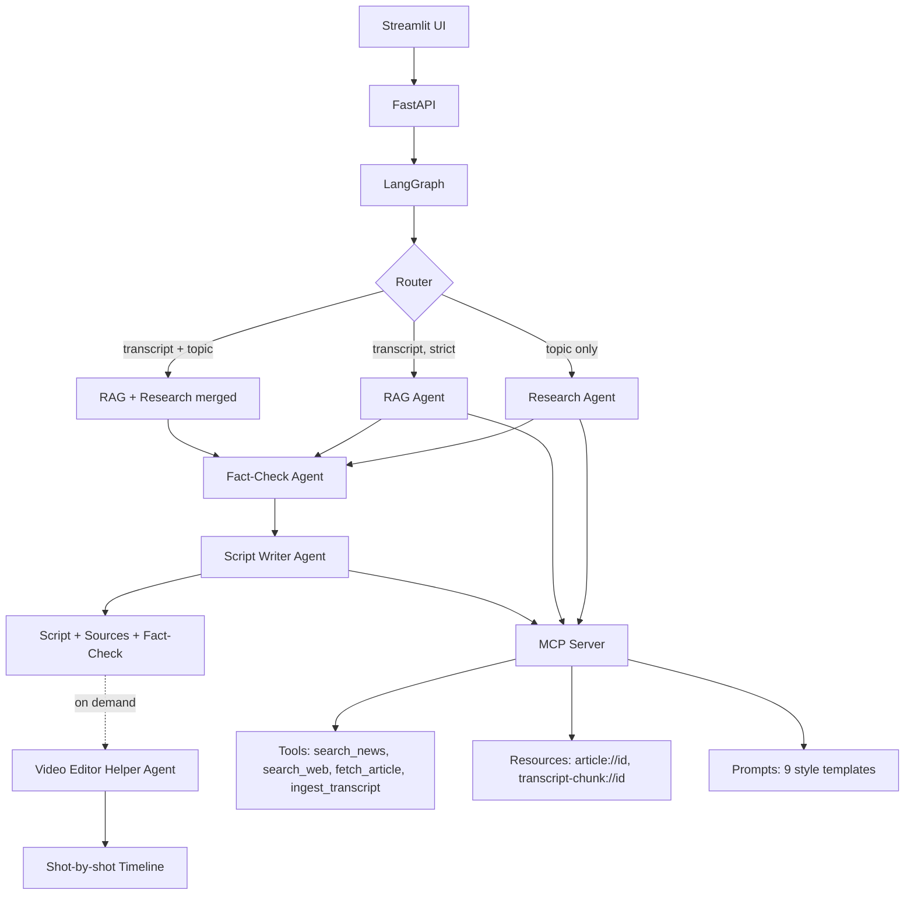

# Video Script Studio

A multi-agent AI system that turns a topic — or your own pasted transcript —
into a duration-aware, teleprompter-ready video script. It researches the
topic across live news and web sources, fact-checks every claim against real
evidence, writes the script in one of nine narrative styles sized exactly to
your target runtime, and can generate a full shot-by-shot editing timeline
on demand.

Built end-to-end on **free-tier tools only**: Groq's free LLM API, free news/
web search, a locally-run embedding model, and free local storage. No paid
services, no Docker, no Kubernetes, no cloud infrastructure required to run it.

Built by **Ramu R - RSLB Systems**.

---

## Table of Contents

- [What This Does](#what-this-does)
- [Features](#features)
- [Architecture](#architecture)
- [Tech Stack](#tech-stack)
- [Why These Choices](#why-these-choices)
- [Getting Started](#getting-started)
- [Configuration](#configuration)
- [Running the App](#running-the-app)
- [API Reference](#api-reference)
- [Usage Guide](#usage-guide)
- [Testing](#testing)
- [Project Structure](#project-structure)
- [Engineering Challenges & Solutions](#engineering-challenges--solutions)
- [Known Limitations](#known-limitations)
- [Roadmap](#roadmap)
- [License](#license)

---

## What This Does

Give it a topic like *"fake medicines racket Bangalore hospitals"* and a
target duration, and it will:

1. Search live news and the web for real, current sources on the topic
2. Fetch full article text and images from the most relevant sources
3. Fact-check the claims that would go into the script against live evidence
4. Write a clean, spoken-word script in your chosen style, sized precisely
   to your target duration (word count is enforced deterministically, not
   left to the LLM's judgment)
5. On request, break that script into a timestamped shot list with camera
   angles, on-screen text suggestions, and resource suggestions for editing

Alternatively, paste your own transcript or article and it will use
Retrieval-Augmented Generation (RAG) to ground the script in your content —
either blended with fresh research, or, in strict mode, using **only** your
pasted content while still fact-checking every claim in the output.

## Features

- **Two content-sourcing modes**
  - *Live research*: pulls from Google News and general web search
  - *RAG mode*: paste a transcript/article; short ones are used directly,
    long ones are chunked, embedded, and the most relevant parts retrieved
  - *Strict mode*: when using RAG, optionally skip all external research and
    use only your pasted content for the script's material (fact-checking
    still always runs, since verifying claims is separate from sourcing them)
- **9 narrative styles**: news, curiosity, documentary, storytelling,
  dramatic, horror, motivational, comedic, neutral — each with a genuinely
  distinct voice, not just a label
- **Duration-aware**: 30s / 60s / 90s / 3min / 8min presets or any custom
  length; word count is deterministically trimmed to a clean sentence
  boundary near the target, not just requested and hoped for
- **Always-on fact-checking**: every generated script's key claims are
  independently searched and verified, labeled Supported / Uncertain /
  Unverified, with a real source link — fabricated citations are actively
  detected and discarded rather than shown as if genuine
- **Anti-hallucination guardrails**: the script writer is explicitly
  instructed never to invent names, numbers, or facts not present in the
  source material, and falls back to generic phrasing when specifics aren't
  available
- **Video editing helper**: on-demand, single-call generation of a full
  shot-by-shot timeline — start/end timestamps, shot type, camera angle,
  on-screen text, and a concrete resource suggestion per line of narration
- **Real sources with images**: pulls original article text, publish dates,
  and images directly from the source pages (including decoding Google
  News's obfuscated redirect links back to the real publisher URL)

## Architecture



**MCP (Model Context Protocol)** is used as designed — one local server
exposing all three of its primitives, not just tool-calling:
- **Tools**: `search_news_tool`, `search_web_tool`, `fetch_article_tool`,
  `ingest_transcript_tool` — the actions that go fetch things
- **Resources**: fetched articles and transcript chunks, cached in-session
  and addressable by URI (`article://<id>`, `transcript-chunk://<id>`) so
  they can be re-read without re-fetching
- **Prompts**: the 9 narrative style templates, each a parameterized MCP
  Prompt taking `topic`, `source_material`, and `duration_seconds`

Internally, the app's own LangGraph agents call the underlying functions
directly (not over the MCP stdio protocol) for performance — spawning a
subprocess per request isn't worth it for tools living in the same codebase.
The MCP server remains fully functional and was verified end-to-end over the
real protocol, so it's ready to be used by any other MCP-compatible client
(e.g. Claude Desktop) if useful later.

**LangGraph** wires the agents into a real graph rather than a linear
script: a conditional router picks one of three paths based on what was
provided (topic only, transcript in strict mode, or both merged), and all
three converge into fact-checking and then script writing.

## Tech Stack

| Layer | Choice | Notes |
|---|---|---|
| LLM | Groq API, `allam-2-7b` | Free tier, chosen for its 500K tokens/day budget — far more generous than newer preview models on the same free tier |
| Agent orchestration | LangGraph | Conditional routing between research/RAG paths |
| Tool/resource/prompt layer | MCP (official `mcp` SDK) | `FastMCP` server, all 3 primitives |
| Backend API | FastAPI | Two endpoints, Pydantic-validated |
| Frontend | Streamlit | Single-file UI, session-state managed |
| Data validation | Pydantic v2 | Single source of truth for all data shapes |
| RAG vector store | ChromaDB | Local, per-transcript collections |
| Embeddings | sentence-transformers (`all-MiniLM-L6-v2`) | CPU-only, no API key |
| News search | Google News RSS + `feedparser` | No API key |
| Web search | DuckDuckGo via `ddgs` | No API key |
| Article extraction | `trafilatura` + `googlenewsdecoder` | Handles Google News's obfuscated redirect links |
| Testing | `pytest` | 98 tests, all real-logic (mocked network only) |
| Formatting | `black` | Enforced every commit |

## Why These Choices

**Why `allam-2-7b` over a bigger model?** Groq's free tier gives wildly
different daily budgets per model — newer preview models (Qwen3, GPT-OSS)
were capped at 200K tokens/day and 1,000 requests/day, while `allam-2-7b`
(a plain, non-agentic chat model) offered 500K tokens/day. For a project
meant to be genuinely free to run repeatedly, that budget mattered more than
raw model size. The trade-off — a 7B model is less reliable at exact
instruction-following — is handled with deterministic guardrails throughout
(see below) rather than by upgrading the model.

**Why not trust the LLM's own length/format judgment?** Small models
reliably ignore precise length and formatting instructions. Rather than
fight this with ever-more-forceful prompt wording, the system generates with
headroom and then deterministically trims to the target at a clean sentence
boundary in plain Python — the same philosophy applies to JSON parsing
(multiple fallback strategies) and source citation (validated against real
evidence URLs, not trusted blindly).

**Why one MCP server instead of a framework like CrewAI?** LangGraph plus a
hand-built MCP layer keeps every piece inspectable and testable in isolation
— each agent is a plain Python function with its own unit tests, and the
graph is just wiring on top. This traded a bit of boilerplate for full
control and transparency, which mattered for a learning-focused build.

## Getting Started

Requires **Python 3.10**.

```bash
git clone <this-repo-url>
cd video-script-studio

python -m venv .venv

# Windows
.venv\Scripts\Activate.ps1
# macOS/Linux
source .venv/bin/activate

# Install CPU-only PyTorch first (avoids ~3GB of unnecessary CUDA packages,
# since only one small embedding model runs locally, on CPU)
pip install torch --index-url https://download.pytorch.org/whl/cpu

pip install -r requirements.txt

cp .env.example .env
```

Then get a **free** API key from [console.groq.com](https://console.groq.com)
and put it in `.env`.

## Configuration

`.env` variables:

| Variable | Required | Description |
|---|---|---|
| `GROQ_API_KEY` | Yes | Your free Groq API key |
| `GROQ_MODEL` | No (defaults to `allam-2-7b`) | Any chat model available on your Groq account |
| `CHROMA_PERSIST_DIR` | No (defaults to `./chroma_data`) | Where RAG's local vector store writes to disk |

## Running the App

Two processes, two terminals:

```bash
# Terminal 1 - backend API
uvicorn backend.main:app --reload
# -> http://127.0.0.1:8000  (interactive docs at /docs)

# Terminal 2 - frontend UI
streamlit run frontend/app.py
# -> http://localhost:8501
```

## API Reference

### `POST /generate-script`

```json
{
  "topic": "fake medicines racket Bangalore hospitals",
  "transcript": null,
  "duration": "60s",
  "style": "news",
  "strict_mode": false,
  "custom_duration_seconds": null
}
```

`duration` is one of `30s | 60s | 90s | 3min | 8min | custom` (if `custom`,
`custom_duration_seconds` is required). `style` is one of the 9 styles
listed above. At least one of `topic` / `transcript` is required.

Response:

```json
{
  "script": "...",
  "word_count": 157,
  "estimated_duration_seconds": 62.8,
  "sources": [
    {
      "title": "...",
      "url": "...",
      "published_date": "2026-09-14",
      "snippet": "...",
      "image_url": "..."
    }
  ],
  "fact_check": [
    {
      "claim": "...",
      "status": "supported",
      "explanation": "...",
      "source_url": "..."
    }
  ]
}
```

### `POST /generate-timeline`

```json
{ "script": "<the script text from /generate-script>", "duration": "60s" }
```

Response:

```json
{
  "timeline": [
    {
      "start_seconds": 0.0,
      "end_seconds": 3.2,
      "voiceover_chunk": "...",
      "shot_type": "talking_head",
      "camera_angle": "close-up on host",
      "onscreen_text": null,
      "resource_suggestion": null
    }
  ]
}
```

### `GET /health`

Returns `{"status": "ok"}`.

## Usage Guide

In the Streamlit sidebar:

1. **Input mode** — "Topic" for live research, or "Paste transcript" for RAG
2. If pasting a transcript, an optional **topic** field adds fresh research
   alongside it; a **"Only use my content"** checkbox appears to enable
   strict mode
3. **Duration** and **Style** dropdowns
4. **Generate Script** — runs the full pipeline (research → fact-check →
   write), typically 20-60 seconds depending on the model's current load
5. Review the **Script** (copy-paste ready for a teleprompter), **Sources**,
   and **Fact-Check** tabs
6. Click **Help for Video Editing** for the shot-by-shot timeline

## Testing

```bash
pytest -v            # 98 tests
black backend frontend tests
```

Tests mock external network calls (search APIs, article fetching, the LLM)
so the suite runs fast and deterministically offline — except for the
embedding and vector-store tests, which use the real local model since
there's no network dependency to mock there.

## Project Structure

```
backend/
  graph/
    build_graph.py          LangGraph wiring: router + all node functions
    research_node.py        Live news/web research, full-text top sources
    rag_node.py              Transcript chunk/embed/retrieve
    factcheck_node.py        Claim extraction + evidence-based verification
    scriptwriter_node.py     Prompt-driven generation + deterministic trimming
    editor_helper_node.py    Shot-by-shot timeline generation
  mcp_server/
    server.py                 FastMCP server: all Tools, Resources, Prompts
    search_functions.py        search_news, search_web (deduped)
    article_functions.py       fetch_article (Google News decode + cleanup)
    resource_store.py          In-memory article cache
    transcript_resource_store.py   In-memory transcript chunk cache
    prompt_loader.py           Loads + fills the 9 style templates
    prompts/                   The 9 style template .txt files
  rag/
    chunker.py                  Sentence-aware chunking with overlap
    embedder.py                  sentence-transformers wrapper
    vector_store.py              ChromaDB wrapper
  schemas.py                     All Pydantic models + Duration conversion
  config.py, llm.py               Settings + Groq client wrapper
  main.py                         FastAPI app
frontend/
  app.py                          Streamlit UI
tests/                            98 pytest tests, one file per module
requirements.txt
pyproject.toml                    black + pytest config
.env.example
```

## Screenshots

1. Input-Form

   

2. Script-Output

   

3. Sources

   

4. Fact-Check

   

5. Editing-Timeline Help

   


## Engineering Challenges & Solutions

This project surfaced a number of real, non-obvious problems worth
documenting — the kind that only show up when you actually run a small
free-tier LLM against real, messy, real-world data rather than a toy example:

- **Windows venv corruption**: a fresh `venv` occasionally ships a broken
  `pip` install (`ModuleNotFoundError: pip._vendor.rich`). Fix: recreate the
  venv from scratch — patching with `ensurepip` alone wasn't reliable.
- **PowerShell here-string BOM**: `Out-File -Encoding utf8` on Windows
  PowerShell silently prepends a BOM, which breaks strict parsers like
  `tomllib`. Fixed with `[System.IO.File]::WriteAllText(...)` writing
  explicit encodings instead.
- **Model rate-limit reality**: Groq's free tier varies wildly by model —
  some newer preview models cap out at 1,000 tokens/minute. Solved by
  checking real account limits directly (`console.groq.com/settings/limits`)
  rather than trusting third-party articles, which were stale/contradictory.
- **`duckduckgo_search` → `ddgs` rename**: the installed version's
  `primp` dependency broke compatibility with an old browser-impersonation
  string. The maintainer had renamed the package entirely; switching fixed it.
- **Google News RSS gives obfuscated redirect links**, not real article
  URLs — resolved by decoding them via `googlenewsdecoder` before fetching.
- **Small-model JSON unreliability**: across the project, the LLM was asked
  for structured JSON output (claims, editing guidance) and returned at
  least three distinct malformation patterns in testing — an extra stray
  leading bracket, objects instead of plain strings, and multiple
  concatenated JSON documents with no separating commas. Solved with a
  layered parser: clean parse → bracket-balance repair → per-object regex
  extraction as a last resort — rather than chasing each new format one at
  a time.
- **LLM length non-compliance**: even with explicit word targets in the
  prompt, the model regularly overshot by 30-60%. Solved by generating with
  headroom and deterministically trimming to the target at a clean sentence
  boundary in code, rather than relying on prompt wording alone.
- **Name/fact hallucination**: the script writer once invented a name
  ("Vishwanatha") for a real person whose actual name ("Veeresh Kumar Jain")
  was clearly present in the source material. Fixed with an explicit
  anti-hallucination instruction directing the model to use generic phrasing
  rather than guess when specifics aren't confidently known.
- **Fabricated fact-check citations**: the fact-checker occasionally
  returned a real-looking but non-existent source URL. Fixed by validating
  every returned `source_url` against the actual set of evidence URLs
  provided to the model, discarding anything that doesn't match exactly.
- **Unhandled search-provider failures**: a transient DuckDuckGo rate limit
  crashed the entire pipeline with an unhandled exception. Fixed by wrapping
  the search call and returning an empty result set on failure, letting
  already-built fallback logic downstream (unverified status, snippet
  fallback) handle it gracefully instead.

## Known Limitations

Deliberate trade-offs of using a free, 7B-parameter LLM to keep this
project fully cost-free:

- Occasional repetition or verbosity in generated scripts
- Search relevance isn't perfect; a generic query can occasionally pull in
  an off-topic source
- No Hindi/Kannada language support currently — `allam-2-7b` is primarily
  an Arabic/English model and wasn't evaluated as reliable for Indian
  languages; adding this would likely require a different model for the
  script-writing step specifically
- No persistent database — Chroma collections are session-scoped and not
  cleaned up automatically between runs (harmless, just unused disk space
  over time)

None of these cause crashes. Every external call (search, fetch, LLM JSON
parsing) has an explicit fallback path, by design.

## Roadmap

Ideas explicitly deferred to keep v1 focused:

- Text-to-speech and automatic video assembly
- Hindi/Kannada/multi-language script generation
- User accounts and saved script history
- Cloud deployment
- Source-relevance filtering (embedding similarity to topic) to reduce
  occasional off-topic sources in research results

## License

MIT

---

Built by **Ramu R - RSLB Systems**
